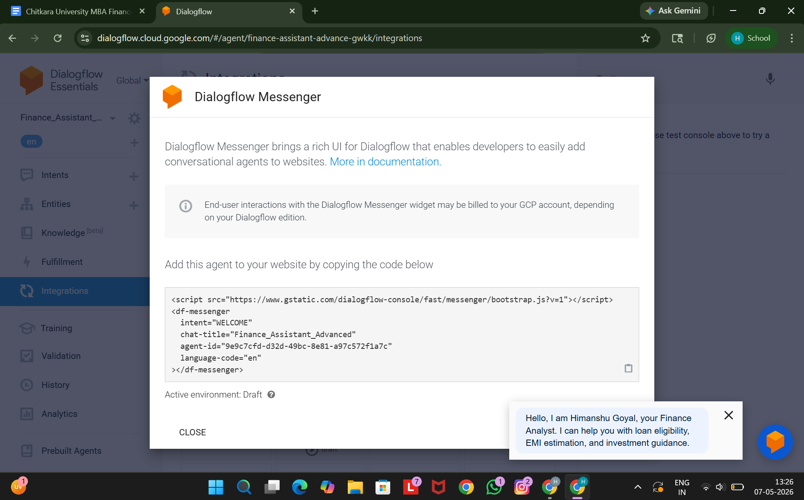
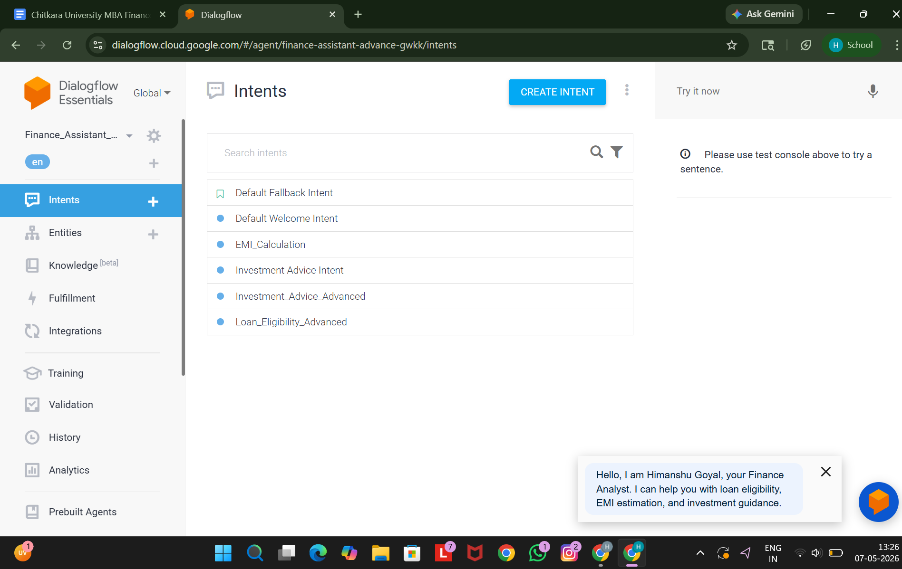
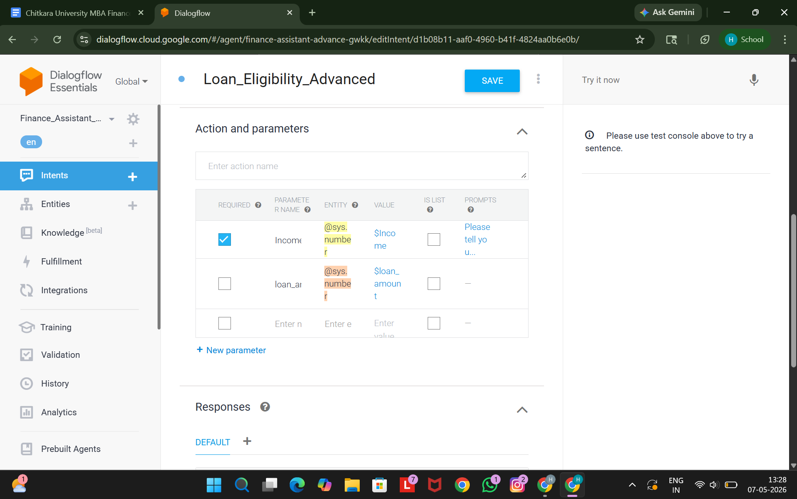
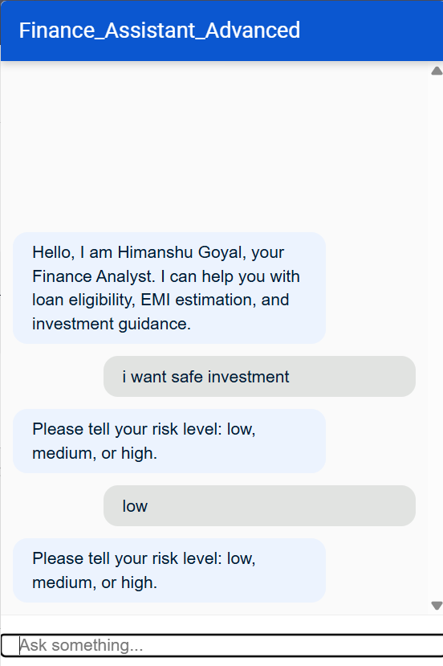

# 💰 Finance Assistant Advanced – AI Chatbot using Dialogflow


---

# 📌 Introduction

Finance Assistant Advanced is an AI-powered chatbot developed using Dialogflow Essentials.  
The chatbot helps users perform financial activities such as:

- 🏦 Loan Eligibility Checking
- 📊 EMI Calculation
- 📈 Investment Guidance
- 💡 Risk-based Financial Advice

The chatbot uses Natural Language Processing (NLP) to understand user queries and respond intelligently.

---

# 🎯 Objectives

The main objectives of this project are:

- Automate financial guidance
- Reduce manual financial consultation
- Provide instant financial support
- Improve customer interaction experience
- Demonstrate AI chatbot integration using Dialogflow

---

# 🛠️ Technologies Used

| Technology | Purpose |
|---|---|
| Dialogflow Essentials | NLP & Chatbot Development |
| Google Cloud Platform | Backend Services |
| HTML5 | Frontend |
| CSS3 | Styling |
| JavaScript | Integration |
| Dialogflow Messenger | Chat Interface |

---

# 🚀 Features

## ✅ Loan Eligibility Checking

The chatbot can determine approximate loan eligibility based on user salary.

### Example Queries

```text
I earn 50000 can I get loan?
My salary is 70000
Can I get loan of 20 lakh?
Loan eligibility for 60000 income
```

### Sample Response

```text
Based on your income, you may be eligible for a loan between ₹12–15 lakhs.
```

---

# 📊 EMI Calculation

The chatbot calculates EMI based on:
- Principal Amount
- Interest Rate
- Loan Tenure

---

## EMI Formula

\[
EMI = \frac{P \times R \times (1+R)^N}{(1+R)^N - 1}
\]

Where:

| Symbol | Meaning |
|---|---|
| P | Principal Loan Amount |
| R | Monthly Interest Rate |
| N | Loan Duration in Months |

---

# 📈 Investment Advice System

The chatbot provides investment guidance based on risk level.

| Risk Level | Suggestions |
|---|---|
| Low | FD, PPF, Government Bonds |
| Medium | Mutual Funds |
| High | Stocks, Crypto, Equity |

---

# 🧠 Dialogflow Intents

The chatbot contains multiple intents.

| Intent Name | Purpose |
|---|---|
| Default Welcome Intent | Welcome Message |
| Default Fallback Intent | Unknown Query Handling |
| EMI_Calculation | EMI Estimation |
| Investment_Advice_Intent | Basic Investment Advice |
| Investment_Advice_Advanced | Risk-based Suggestions |
| Loan_Eligibility_Advanced | Loan Eligibility |

---

# 📸 Screenshots

---

## 🔹 Dialogflow Messenger Integration



---

## 🔹 Intents Created



---

## 🔹 Training Phrases


---

## 🔹 Parameters Configuration



---

## 🔹 Chatbot Output



---

# 📈 Future Enhancements

- ✅ Voice-enabled chatbot
- ✅ Real-time Banking APIs
- ✅ Firebase Database Integration
- ✅ User Authentication
- ✅ Multi-language Support
- ✅ AI-based Financial Predictions
- ✅ Personalized Financial Planning

---

# 🔒 Security Features

- Input Validation
- Secure Dialogflow Integration
- User Query Sanitization
- Cloud-based Deployment

---

# 📊 Advantages of Project

- Fast customer interaction
- 24/7 financial support
- User-friendly interface
- AI-based automation
- Easy integration into websites

---

# 📚 Learning Outcomes

By building this project, you can learn:

- Dialogflow NLP
- Chatbot Design
- Intent Management
- Entity Extraction
- Frontend Integration
- Conversational AI

---

# 👨‍💻 Author

## Himanshu Goyal

MBA Finance + AI Chatbot Developer

---

# 📄 License

This project is developed for educational and learning purposes.

---

# ⭐ Support

If you like this project:

⭐ Star the repository  
🍴 Fork the project  
📢 Share with others

---

# 🙌 Acknowledgement

Special thanks to:

- Google Dialogflow
- Google Cloud Platform
- Open Source Community

---
